## Welcome to Bookworms!

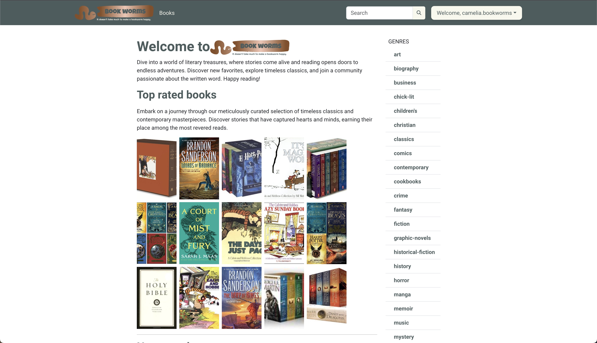

*Bookworms* is a platform designed for book enthusiasts—a space where users can search, rate, review, and discuss books. While currently focused on core features like discovering new reads, creating lists, and engaging in book-related discussions, Bookworms aims to evolve into a bustling community connecting authors and readers alike.

### [Live View](https://book-worms-761406c409e0.herokuapp.com/)

## CONTENTS

* [User Experience (UX)](#User-Experience-UX)
  * [Initial Project](#Initial-Project)
  * [User Stories](#User-Stories)
  * [Responsivity](#responsivity)
  * [User Friendly Messages](#user-friendly-messages)

* [Design](#Design)
  * [Color Scheme](#Color-Scheme)
  * [Typography](#Typography)
  * [Wireframes](#Wireframes)
  * [Features](#Features)

* [Technologies Used](#Technologies-Used)
  * [Languages Used](#Languages-Used)
  * [Frameworks, Libraries & Programs Used](#Frameworks-Libraries--Programs-Used)

* [Database Design](#Database-Design)
  * [Relationship Diagram](#Relationship-Diagram)
  * [Models](#Models)

* [Agile Development Process](#Agile-Development-Process)
  * [GitHub Projects](#GitHub-Projects)
  * [GitHub Issues](#GitHub-Issues)
  * [Moscow Prioritization](#Moscow-Prioritization)

* [Testing](#Testing)

* [Deployment & Development](#Deployment--Development)
    * [Deploy on Heroku](#Deploy-on-Heroku)
     * [Database Setup](#Database-Setup)
    * [Development](#Development)

* [ Credits](#Credits)
    * [Code](#Code)
    * [Media](#Media)
    * [Acknowledgements](#Acknowledgements)

## User-Experience-UX

### Initial-Project

Bookworms stemmed from a passionate vision to create a haven for book enthusiasts—a space that echoes the joy of diving into the world of literature. The initial spark ignited with the aspiration to develop a platform akin to Goodreads, fostering a community where readers could discover, discuss, and share their love for books.

The primary goal was to craft an intuitive and engaging platform that allows users to explore new reads, compile personal reading lists, and dive into book-centric discussions. While inspired by Goodreads, Bookworms began as a simplified version, focusing on core features like book exploration, reviews, and discussions.

Throughout the conceptualization phase, the aim was clear: to build a digital sanctuary for bibliophiles, providing a seamless experience for book discovery and interaction. As the project evolves, the intention is to expand and enrich the platform, incorporating features that amplify the reading experience and foster deeper connections between authors and readers.

Main Features:

- Search, rate, review, and discuss books.
- Discover new books and compile reading lists.
- Engage in book-centric discussions with fellow readers.
- Get personalized recommendations based on your reading preferences.

Mission Statement:
_"It doesn't take much to make a bookworm happy!"_ - Bookworms strives to be your go-to space for book exploration and discussion.

Join us as we grow into a thriving community for bibliophiles and readers to explore, discuss, and share their love for books.

# User-Stories

Some of the most important user stories are:

- As a guest I can sign in to the app to access functionality for logged-in users.

- As a guest or registered user, I can access a navigation bar from any page so that I can easily navigate between pages.

- As a guest or registered user, I can view the details of a single book so that I can learn more about the book's summary, author, and user reviews but also a comments section.

- As a guest or registered user, I can search for books with keywords to find books I'm most interested in.

- As a guest or registered user, I can view the details of a single book so that I can learn more about the book's summary, author, and user reviews but also a comments section.

- As a registered user, I can add a review to a book so that I can share my thoughts and feedback about the book with others.

- As a registered user, I can edit my book review so that I can make corrections or updates to my review.

- As a registered user, I can delete my own review of a book so that I can manage and remove my feedback when necessary.

All user stories as part of a project: https://github.com/users/Camelia03/projects/8

# Responsivity

Two primary device views have been considered to ensure responsiveness in Bookworms: mobile and larger monitor displays. While efforts have been made to enhance the application's mobile-friendliness, there's still room for improvement. Bootstrap5 features and custom CSS have been utilized as methods to achieve the desired level of device responsiveness.

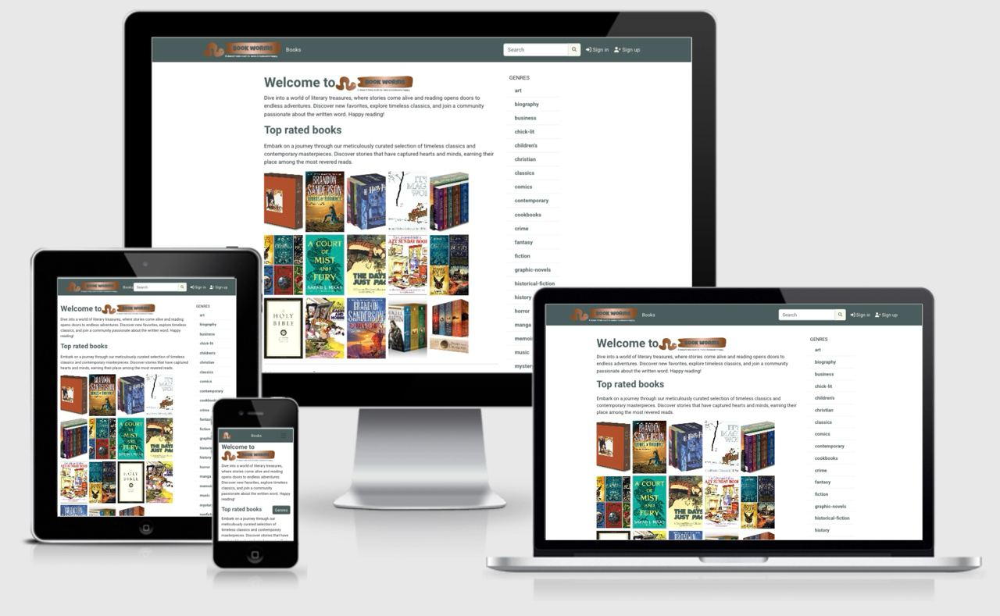

# User-friendly-messages
To ensure users feel confident about their actions and to offer clear guidance, the system generates user-friendly messages. These messages are crafted to provide reassurance, affirming the user's choices, while also offering helpful direction to navigate through the platform effectively. They serve as informative prompts, designed to support users by acknowledging their actions and steering them toward successful interactions within the system.

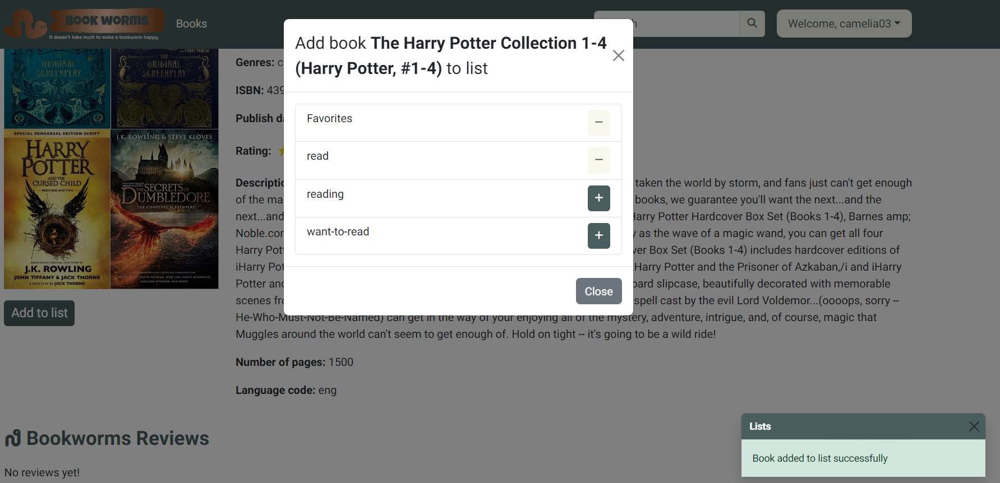

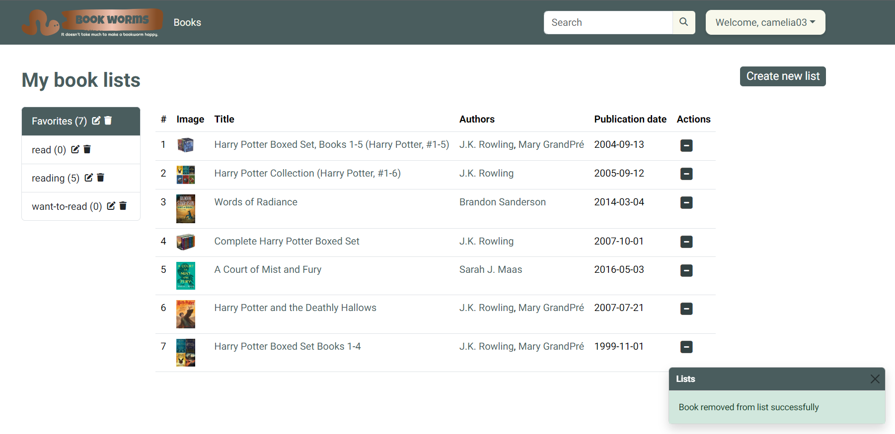

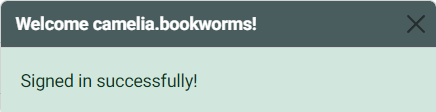

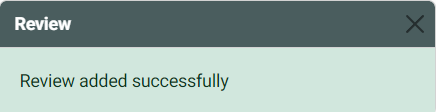

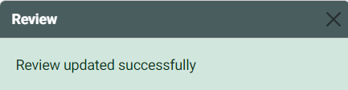

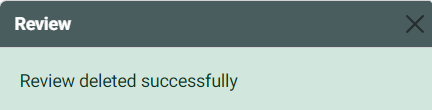

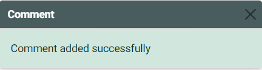

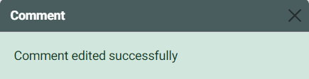

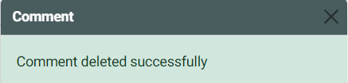

## Design

### Color-Scheme
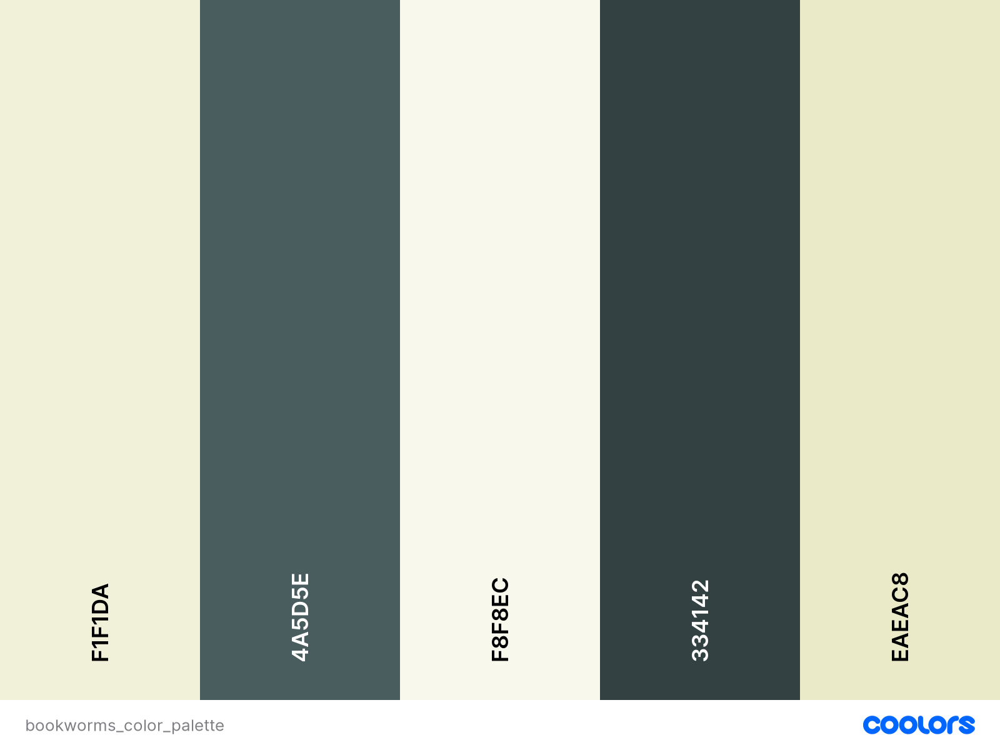

The color palette was created using the [Coolors](https://coolors.co/) website.

- #4a5d5e - serves as the primary color, offering a sophisticated and deep teal tone primarily applied to buttons, instilling a sense of modernity and elegance.
- #404e4f - is the hover state for primary-colored buttons, providing a slightly darker shade that adds depth and interactivity when users interact with these elements.
- #f8f8ec - functions as the secondary color, presenting a soft and inviting pale hue used for navigation, footer details, and other interface elements, creating a serene and approachable ambiance.
- #f1f1da - represents the hover state for secondary-colored buttons, offering a gentle shift in tone, maintaining the calming effect while subtly indicating interactivity.
- transparent (applied as _background-color: transparent;_) denotes clear elements, ensuring a minimalist and sleek appearance, with a color text of #334142 providing contrast and readability.
- #eaeac8 - signifies the active state for secondary-colored buttons, elevating the soft tone slightly to maintain visual interest without overwhelming the interface.

This color scheme combines a rich blend of hues to create a sophisticated and balanced palette. The primary color, represented by a deep, elegant shade of teal, exudes a sense of modernity and sophistication. Its complementary hover and active states offer a subtle shift, adding depth and interactivity without overpowering the primary tone.

In contrast, the secondary color employs a soft, pale hue reminiscent of light parchment. This color brings a calming and approachable feel to elements such as navigation bars and details within the interface. Its hover and active states gently elevate the tone, maintaining a serene ambiance.

Lastly, the clear elements maintain transparency while being highlighted by a dark charcoal text, ensuring clarity and readability. The absence of a defined background provides a sleek, minimalist touch to these particular interface elements.

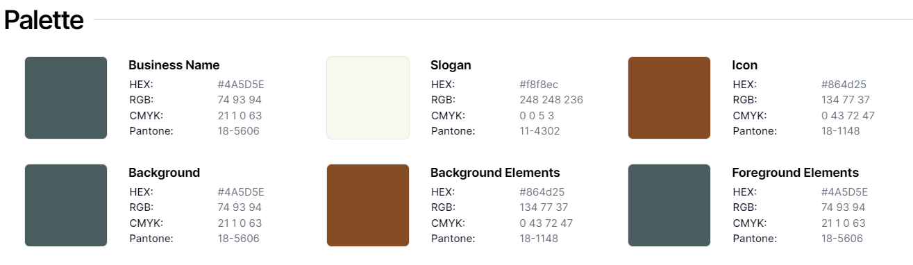
The logo was created using the [LOGO](https://app.logo.com/) website.

### Typography

Google Fonts was used for the following fonts:

* _Luckiest Guy Regular_ is used as a primary font and Righteous Regular is used as a secondary font for the logo of Bookworms. Both are sans-serif fonts.
* _Roboto_ is used for the body text on the website. It is a sans-serif font. 

- [Font Awesome](https://fontawesome.com) icons were used throughout the site, such as the add, edit or delete buttons, and the little worm in the header of the _Home Page_ and _Bookworms reviews_.

### Wireframes
I've used [Balsamiq](https://balsamiq.com/wireframes) to design my site wireframes for mobile and desktop.

### Sign In Page

View Sign In Page

#### Desktop

#### Mobile

### Sign Up Page

View Sign Up Page

#### Desktop

#### Mobile

### Home Page

View Home Page

#### Desktop

#### Mobile

### All Books Page

View All Books Page

#### Desktop

#### Mobile

### Book Details Page

View Book Details Page

#### Desktop

#### Mobile

### Edit Review Page

View Edit Review Page

#### Desktop

#### Mobile

### Genres Sidebar

View Genres sidebar

#### Desktop

#### Mobile

### My Reviews page

View My Reviews page

#### Desktop

#### Mobile

### Other user's profile Page

View Other user's profile Page

#### Desktop

#### Mobile

### Search Filter

View Search Filter

#### Desktop

#### Mobile

### My Profile Page

View My Profile Page

#### Desktop

#### Mobile

### Features

### Existing Features

- **Header and Navigation**

    - The navigation bar features a logo, the page's name, and links tailored for both unauthenticated and authenticated users. 
        - The nav bar contains everything the user will need to navigate the site. The site logo always appears on the site menu with the other items only showing for logged in users. 

        - For _unauthenticated users (guests)_, the navbar grants access not only to authentication pages like Signup and Login, but also to a search filter, All Books Pages with sorting options, detailed Book Details Pages including descriptions, authors, ratings, reviews, and comments. Additionally, the Home Page showcases lists of 'Newest Releases' and 'Top Rated Books' for easy exploration.

        - For _authenticated users_, the nav bar hides the authentication pages and shows only a search bar, a dropdown menu for user's profile and the logo. From the dropdown menu for user's profile, the user can go to their profile page(for editing their profile), to their reviews and lists(for editing or delete their reviews and lists) or to simply log out.

- **Landing Page or Home Page**

    - This page is where users arrive when they first visit the site or before they log in if they don't have an active session. It greets them and provides the choice to either create a new account or access an existing one from the Navbar.

    

- **Sign In Page**

    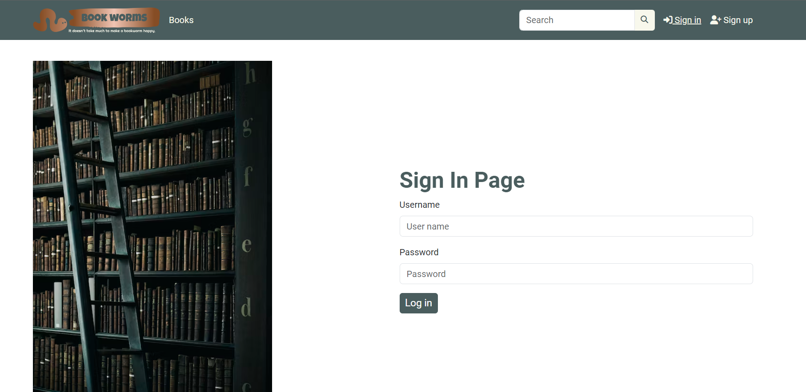

- **Sign Up Page**

    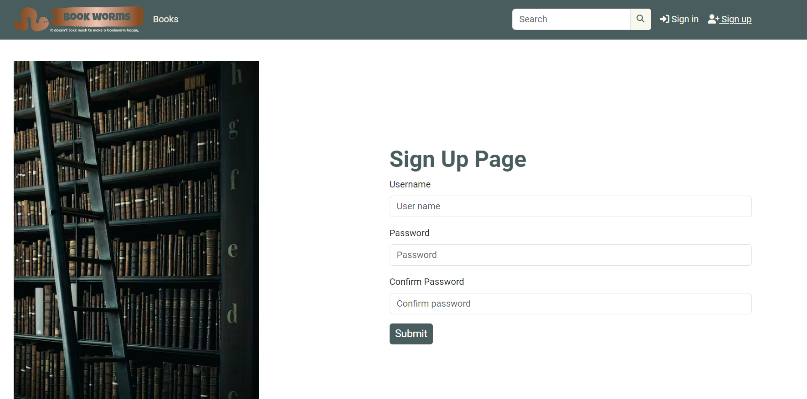

- **Reset Password**

    - Users who need to change their password can acces a Change Password Page from thei Edit Profile Page, where they can enter and update a new password.

    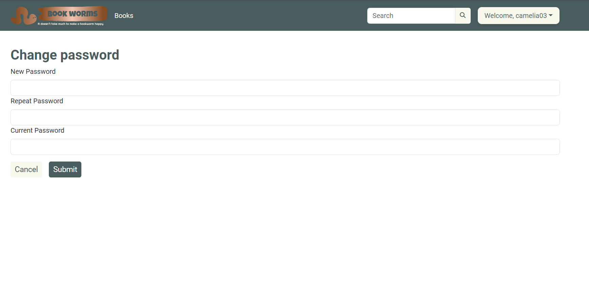

- **All Books and Order by**

    - The All Books Page displays a comprehensive list of all available books, allowing users to conveniently filter books by title and publication date.

    

- **Pagination**

  - Pagination with infinite scrolling provides a seamless browsing experience, allowing users to navigate content continuously without traditional page-by-page navigation.

- **Book Details**

    - The Book Details Page offers an in-depth look into a specific book, presenting comprehensive information such as its synopsis, author details, ISBN, publication date, ratings, user reviews, and comments on these reviews.

    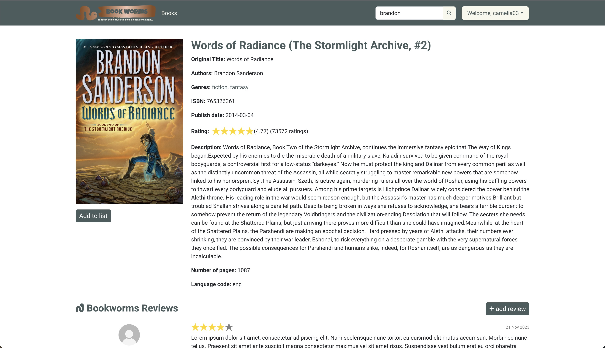

- **My Profile Page**

    - My Profile Page showcases a user's complete name, avatar, brief description, joined date, and last updated information. It includes interactive buttons for editing the profile and changing the password.

    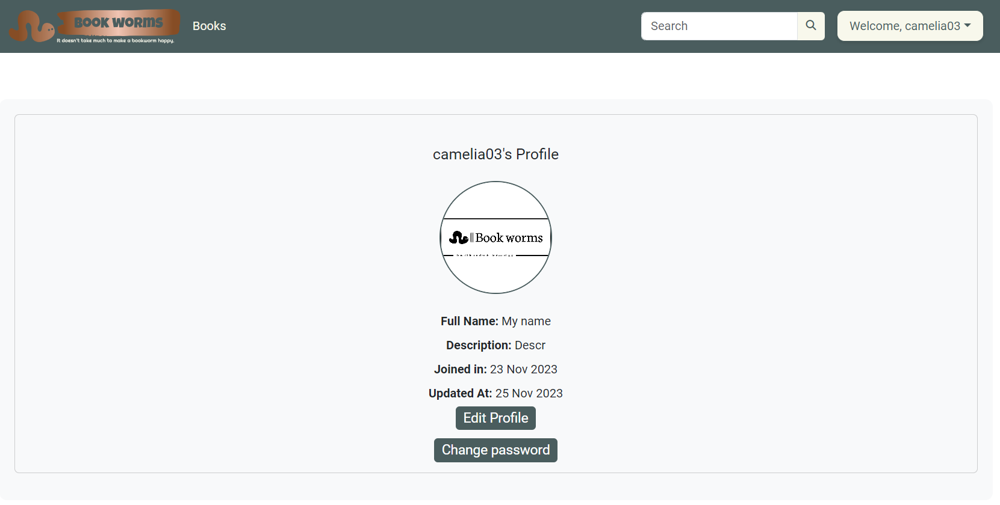

- **Edit Profile**

    - The "Edit Profile" section provides a comprehensive form for users. It features fields for updating the username, selecting or modifying the profile image, and editing the "About Me" section. Users have the options to save their changes or cancel the process, conveniently accessible through corresponding buttons. Once changes are submitted, a success message confirms the successful update.

    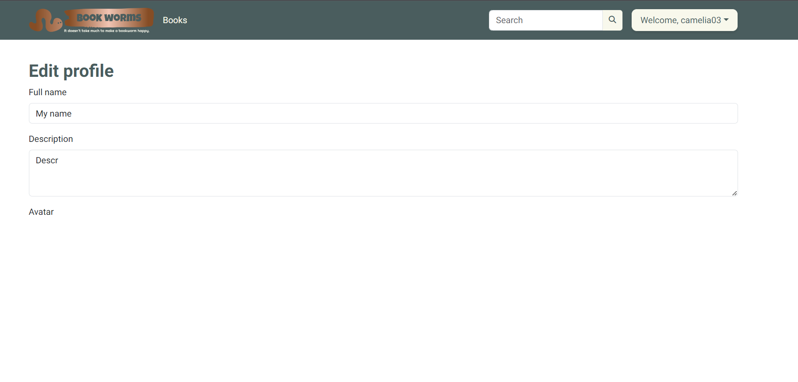

- **My reviews Page**

    - The My Reviews Page displays a personalized collection of the user's submitted reviews, offering a comprehensive overview of their shared thoughts and opinions on various books

    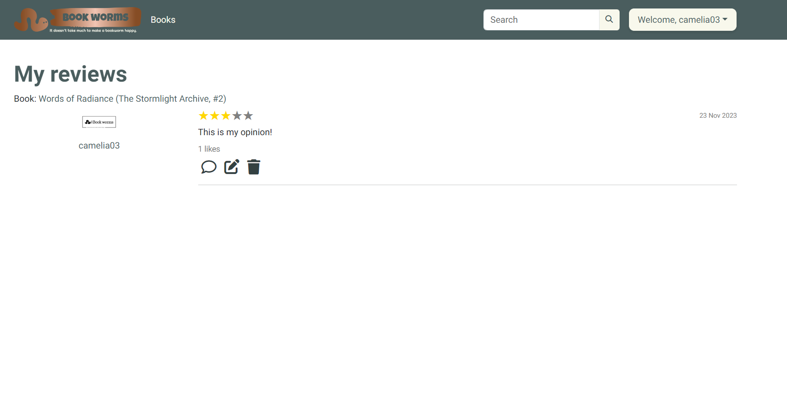

- **Reviews**

    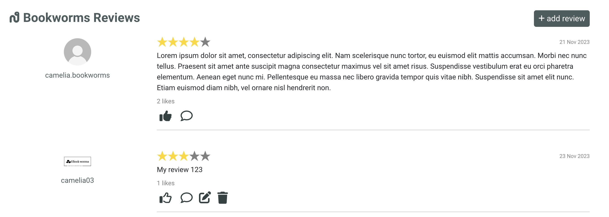

- **Add Review**

    - This functionality enables users to express their thoughts and insights on a book. Available platform-wide, it invites users to select a book, write their review, rate the book, and share their perspective.

    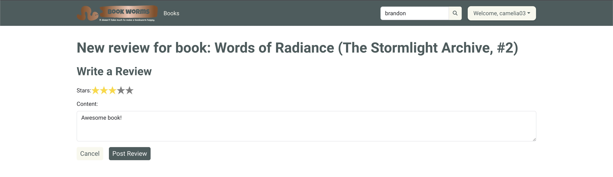

- **Edit Review**

    - The Edit Review feature allows users to modify or update their previously submitted reviews, providing an opportunity to refine or add to their thoughts on a book.

    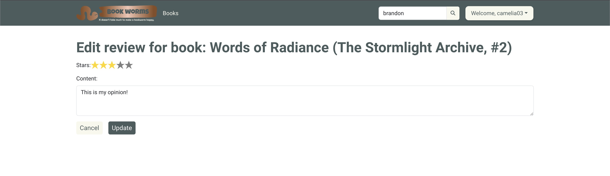

- **Delete Review**

    - The Delete Review function enables users to remove their previously submitted reviews, allowing them to manage and control the content they've shared about a book.

    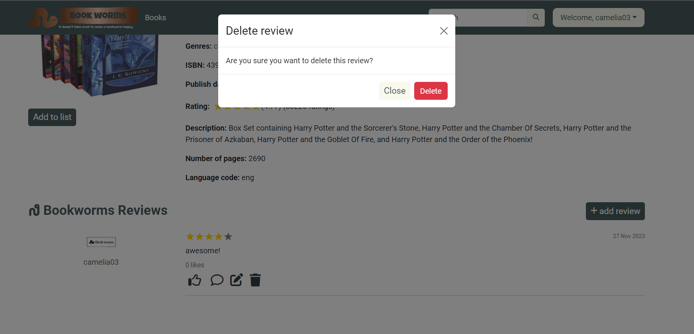

- **Comments**

    - Comments are user-generated responses linked to reviews, providing an avenue for users to share their thoughts, engage with others, and potentially edit or delete their own comments within this dedicated section.

    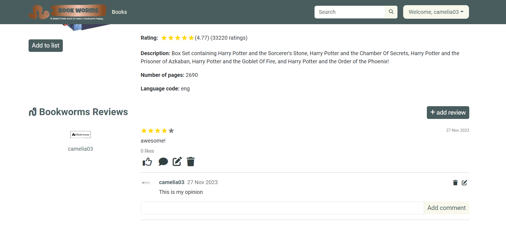

- **Like**

    - Likes are a feature that allows users to express appreciation for a review by clicking to indicate their approval. Users can also undo their like if they change their mind.

- **Other user's Profile**

    - The Other User's Profile provides an overview of their full name, a brief description, joined date, and last updated information. Additionally, it showcases the reviews submitted by that user, offering insight into their contributions and perspectives.

    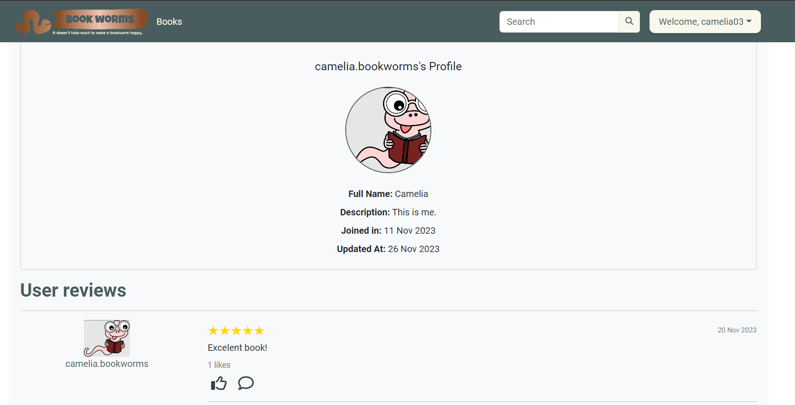

- **Search**

    - The search bar empowers users to quickly find what they're looking for. It allows users to enter keywords or phrases, and it expertly guides them to books that match their interests. 

    - Even if no results are found for a specific keyword, the search bar ensures the user informed, allowing them to refine their search or explore other topics.

- **Genres Sidebar**

    - The Genres Sidebar is a navigational section that categorizes books into different genres or categories, allowing users to explore and filter books based on specific genres of interest.

    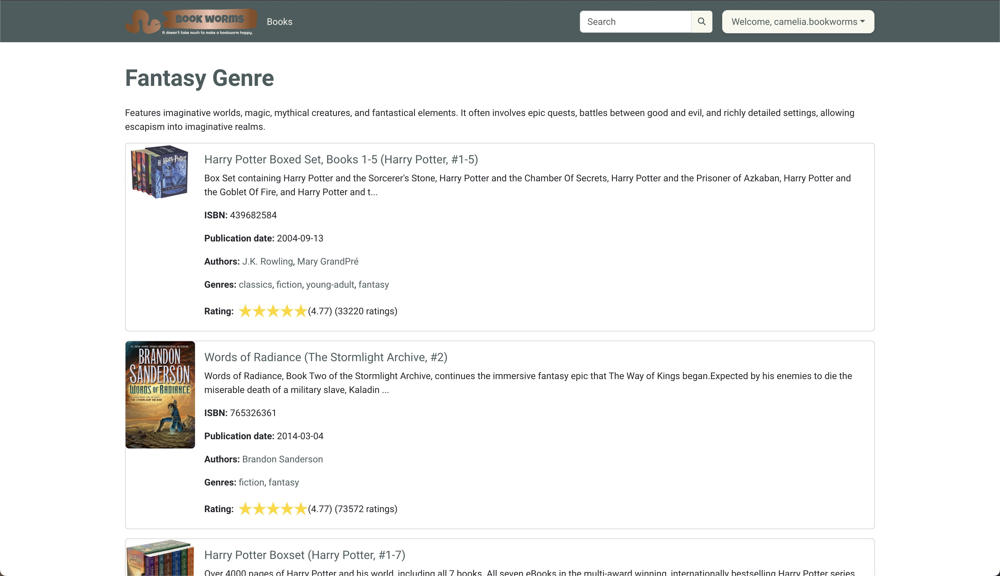

- **Logout**

    - To conclude their session and log out, users can do so conveniently from the My Profile dropdown menu.

    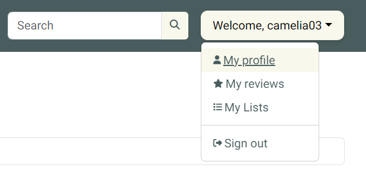

- **Top Rated books**

    - Top Rated Books and Other Tops feature prominently on the home page, showcasing a collection of book images. Hovering over a book image reveals a concise card displaying key details such as the book title, author, brief description, ISBN, publication date, and ratings, providing a snapshot of each book's essential information.

    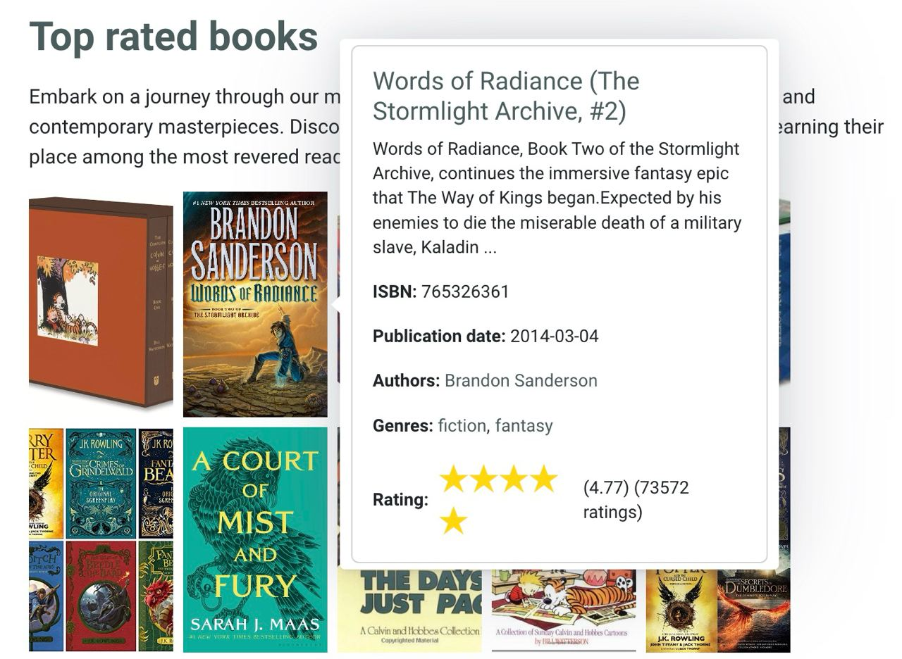

