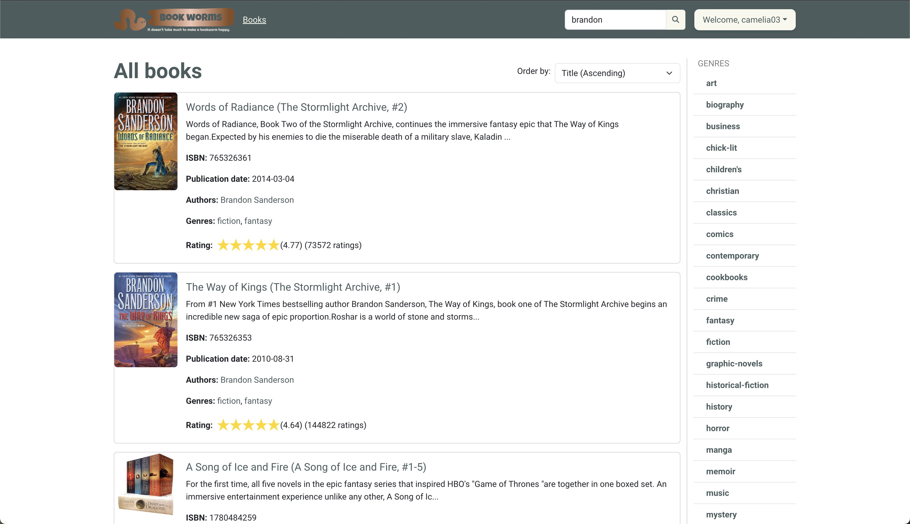
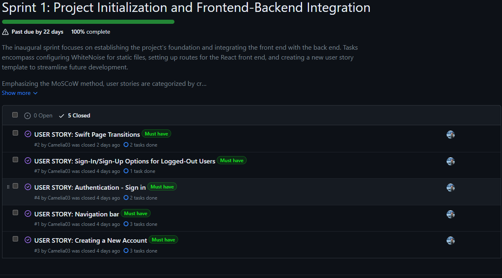

## Welcome to Bookworms!

*Bookworms* is a platform designed for book enthusiasts—a space where users can search, rate, review, and discuss books. While currently focused on core features like discovering new reads, creating lists, and engaging in book-related discussions, Bookworms aims to evolve into a bustling community connecting authors and readers alike.

### [Live View](https://book-worms-761406c409e0.herokuapp.com/)

## CONTENTS

* [User Experience (UX)](#User-Experience-UX)
  * [Initial Project](#Initial-Project)
  * [Responsivity](#responsivity)
  * [User Friendly Messages](#user-friendly-messages)

* [Design](#Design)
  * [Color Scheme](#Color-Scheme)
  * [Typography](#Typography)
  * [Wireframes](#Wireframes)

* [Features](#Features)
  *[Future Features](#Future-Features)

* [Development](#Development)
  * [Languages Used](#Languages-Used)
  * [Frameworks & Libraries](#Frameworks--Libraries)
  * [Tools](#Tools)
  * [Commonly Reused Components](#Commonly-Reused-Components)
  * [Books importer](#Books-importer)

* [Database Design](#Database-Design)
  * [Relationship Diagram](#Relationship-Diagram)
  * [Models](#Models)
  * [Endpoints](#Endpoints)

* [Agile Development Process](#Agile-Development-Process)
  * [User Stories](#User-Stories)
  * [Moscow Prioritization](#Moscow-Prioritization)
  * [Sprints(milestones)](#Sprints)

* [Testing](#Testing)
     * [Bugs](#Bugs)

* [Deployment](#Deployment)

* [ Credits](#Credits)
    * [Code](#Code)
    * [Media](#Media)
    * [Acknowledgements](#Acknowledgements)

## User-Experience-UX

### Initial-Project

Bookworms stemmed from a passionate vision to create a haven for book enthusiasts—a space that echoes the joy of diving into the world of literature. The initial spark ignited with the aspiration to develop a platform akin to Goodreads, fostering a community where readers could discover, discuss, and share their love for books.

The primary goal was to craft an intuitive and engaging platform that allows users to explore new reads, compile personal reading lists, and dive into book-centric discussions. While inspired by Goodreads, Bookworms began as a simplified version, focusing on core features like book exploration, reviews, and discussions.

Throughout the conceptualization phase, the aim was clear: to build a digital sanctuary for bibliophiles, providing a seamless experience for book discovery and interaction. As the project evolves, the intention is to expand and enrich the platform, incorporating features that amplify the reading experience and foster deeper connections between authors and readers.

Main Features:

- Search, rate, review, and discuss books.
- Discover new books and compile reading lists.
- Engage in book-centric discussions with fellow readers.
- Get personalized recommendations based on your reading preferences.

Mission Statement:
_"It doesn't take much to make a bookworm happy!"_ - Bookworms strives to be your go-to space for book exploration and discussion.

Join us as we grow into a thriving community for bibliophiles and readers to explore, discuss, and share their love for books.

### Responsivity

Two primary device views have been considered to ensure responsiveness in Bookworms: mobile and larger monitor displays. While efforts have been made to enhance the application's mobile-friendliness, there's still room for improvement. Bootstrap5 features and custom CSS have been utilized as methods to achieve the desired level of device responsiveness.

### User-friendly-messages
To ensure users feel confident about their actions and to offer clear guidance, the system generates user-friendly messages. These messages are crafted to provide reassurance, affirming the user's choices, while also offering helpful direction to navigate through the platform effectively. They serve as informative prompts, designed to support users by acknowledging their actions and steering them toward successful interactions within the system.

## Design

### Color-Scheme

The color palette was created using the [Coolors](https://coolors.co/) website.

- #4a5d5e - serves as the primary color, offering a sophisticated and deep teal tone primarily applied to buttons, instilling a sense of modernity and elegance.
- #404e4f - is the hover state for primary-colored buttons, providing a slightly darker shade that adds depth and interactivity when users interact with these elements.
- #f8f8ec - functions as the secondary color, presenting a soft and inviting pale hue used for navigation, footer details, and other interface elements, creating a serene and approachable ambiance.
- #f1f1da - represents the hover state for secondary-colored buttons, offering a gentle shift in tone, maintaining the calming effect while subtly indicating interactivity.
- transparent (applied as _background-color: transparent;_) denotes clear elements, ensuring a minimalist and sleek appearance, with a color text of #334142 providing contrast and readability.
- #eaeac8 - signifies the active state for secondary-colored buttons, elevating the soft tone slightly to maintain visual interest without overwhelming the interface.

This color scheme combines a rich blend of hues to create a sophisticated and balanced palette. The primary color, represented by a deep, elegant shade of teal, exudes a sense of modernity and sophistication. Its complementary hover and active states offer a subtle shift, adding depth and interactivity without overpowering the primary tone.

In contrast, the secondary color employs a soft, pale hue reminiscent of light parchment. This color brings a calming and approachable feel to elements such as navigation bars and details within the interface. Its hover and active states gently elevate the tone, maintaining a serene ambiance.

Lastly, the clear elements maintain transparency while being highlighted by a dark charcoal text, ensuring clarity and readability. The absence of a defined background provides a sleek, minimalist touch to these particular interface elements.

The logo was created using the [LOGO](https://app.logo.com/) website.

### Typography

Google Fonts was used for the following fonts:

* _Luckiest Guy Regular_ is used as a primary font and Righteous Regular is used as a secondary font for the logo of Bookworms. Both are sans-serif fonts.
* _Roboto_ is used for the body text on the website. It is a sans-serif font. 

- [Font Awesome](https://fontawesome.com) icons were used throughout the site, such as the add, edit or delete buttons, and the little worm in the header of the _Home Page_ and _Bookworms reviews_.

### Wireframes
I've used [Balsamiq](https://balsamiq.com/wireframes) to design my site wireframes for mobile and desktop.

#### Sign In Page

View Sign In Page

#### Desktop

#### Mobile

#### Sign Up Page

View Sign Up Page

#### Desktop

#### Mobile

#### Home Page

View Home Page

#### Desktop

#### Mobile

#### All Books Page

View All Books Page

#### Desktop

#### Mobile

#### Book Details Page

View Book Details Page

#### Desktop

#### Mobile

#### Edit Review Page

View Edit Review Page

#### Desktop

#### Mobile

#### Genres Sidebar

View Genres sidebar

#### Desktop

#### Mobile

#### My Reviews page

View My Reviews page

#### Desktop

#### Mobile

#### My Lists page

View My Lists page

#### Desktop

#### Mobile

#### Other user's profile Page

View Other user's profile Page

#### Desktop

#### Mobile

#### Search Filter

View Search Filter

#### Desktop

#### Mobile

#### My Profile Page

View My Profile Page

#### Desktop

#### Mobile

## Features

### Existing Features

- **Header and Navigation**

    - The navigation bar features a logo, the page's name, and links tailored for both unauthenticated and authenticated users. 
        - The nav bar contains everything the user will need to navigate the site. The site logo always appears on the site menu with the other items only showing for logged in users. 

        - For _unauthenticated users (guests)_, the navbar grants access not only to authentication pages like Signup and Login, but also to a search filter, All Books Pages with sorting options, detailed Book Details Pages including descriptions, authors, ratings, reviews, and comments. Additionally, the Home Page showcases lists of 'Newest Releases' and 'Top Rated Books' for easy exploration.

        - For _authenticated users_, the nav bar hides the authentication pages and shows only a search bar, a dropdown menu for user's profile and the logo. From the dropdown menu for user's profile, the user can go to their profile page(for editing their profile), to their reviews and lists(for editing or delete their reviews and lists) or to simply log out.

- **Landing Page or Home Page**

    - This page is where users arrive when they first visit the site or before they log in if they don't have an active session. It greets them and provides the choice to either create a new account or access an existing one from the Navbar.

    

- **Sign In Page**

    

- **Sign Up Page**

    

- **Reset Password**

    - Users who need to change their password can acces a Change Password Page from the Edit Profile Page, where they can enter and update a new password.

    

- **All Books and Order by**

    - The All Books Page displays a comprehensive list of all available books, allowing users to conveniently order books by title and publication date.

    

- **Pagination**

  - Pagination with infinite scrolling provides a seamless browsing experience, allowing users to navigate content continuously without traditional page-by-page navigation.

- **Book Details**

    - The Book Details Page offers an in-depth look into a specific book, presenting comprehensive information such as its synopsis, author details, ISBN, publication date, ratings, user reviews, and comments on these reviews.

    

- **My Profile Page**

    - My Profile Page showcases a user's complete name, avatar, brief description, joined date, and last updated information. It includes interactive buttons for editing the profile and changing the password.

    

- **Edit Profile**

    - The "Edit Profile" section provides a comprehensive form for users. It features fields for updating the username, selecting or modifying the profile image, and editing the "About Me" section. Users have the options to save their changes or cancel the process, conveniently accessible through corresponding buttons. Once changes are submitted, a success message confirms the successful update.

    

- **My reviews Page**

    - The My Reviews Page displays a personalized collection of the user's submitted reviews, offering a comprehensive overview of their shared thoughts and opinions on various books

    

- **Reviews**

    

- **Add Review**

    - This functionality enables users to express their thoughts and insights on a book. Available platform-wide, it invites users to select a book, write their review, rate the book, and share their perspective.

    

- **Edit Review**

    - The Edit Review feature allows users to modify or update their previously submitted reviews, providing an opportunity to refine or add to their thoughts on a book.

    

- **Delete Review**

    - The Delete Review function enables users to remove their previously submitted reviews, allowing them to manage and control the content they've shared about a book.

    

- **Comments**

    - Comments are user-generated responses linked to reviews, providing an avenue for users to share their thoughts, engage with others, and potentially edit or delete their own comments within this dedicated section.

    

- **Like**

    - Likes are a feature that allows users to express appreciation for a review by clicking to indicate their approval. Users can also undo their like if they change their mind.

- **Other user's Profile**

    - The Other User's Profile provides an overview of their full name, a brief description, joined date, and last updated information. Additionally, it showcases the reviews submitted by that user, offering insight into their contributions and perspectives.

    

- **Search**

    - The search bar empowers users to quickly find what they're looking for. It allows users to enter keywords to filter books by title, author, or description, expertly guiding them to books that match their interests. 

    - Even if no results are found for a specific keyword, the search bar ensures the user informed, allowing them to refine their search or explore other topics.

- **Genres Sidebar**

    - The Genres Sidebar is a navigational section that categorizes books into different genres or categories, allowing users to explore and filter books based on specific genres of interest.

    

- **Logout**

    - To conclude their session and log out, users can do so conveniently from the My Profile dropdown menu.

    

- **Top Rated books**

    - Top Rated Books and Other Tops feature prominently on the home page, showcasing a collection of book images. Hovering over a book image reveals a concise card displaying key details such as the book title, author, brief description, ISBN, publication date, and ratings, providing a snapshot of each book's essential information.

    

### Future Features
- Follow other users
    - Registered users will have the option to follow other users on the platform. This ensures they receive updates about their activities.

- Receiving messages from other users
    - Registered users will have the opportunity to receive and interact with messages sent by fellow readers or users within the platform.

## Development

### Technologies Used
#### Frontend
- Language:
    - JavaScript & HTML/CSS: Provide the structural and stylistic foundation for the application's web pages.
- Framework:
    - React: Forms the core of the front-end, allowing dynamic and responsive user interfaces.
- Libraries:
    - Bootstrap with React Bootstrap: Aids in designing consistent and mobile-first front-end components.
    - Axios: Facilitates HTTP requests handling within the application.
    - React Router Dom: Manages navigation and routing in the React application.
    - TippyJS: Creates tooltips used to display books.
    - React Infinite Scroll: Used to implement infinite scroll instead of traditional pagination.
    - React Rating Stars: Used to display stars for ratings.
    - JWT Decode: Used to decode JWT tokens received from the Backend.

#### Backend
-Language:
    - Python: High level general purpose programming language used for backend development.
- Framework:
    - Django Rest Framework: Utilized for backend infrastructure, offering a powerful framework for rapid development and enabling robust API development and data handling.
- Libraries:
    - Cloudinary Storage: Integrated for efficient cloud-based storage management.
    - Pillow: Employed for image processing within the application.
    - Django Filter: Provides a filtering backend for Django.
    - Dj Rest Auth and Django All Auth: Provides authentication backend.
    - Dj Database URL: Allows parsing of database DSNs.
    

### Tools

Here's a rundown of the key tools and platforms utilized in this project:

 - GitHub: Serves as the host for the website's source code. It also records the Agile development framework implementation, incorporating issues, milestones, and projects.
 - ElephantSQL: Used as the Postgres database.
 - Heroku: Used for deploying the live version of the website.
 - Cloudinary: Acts as a cloud storage solution for website media and static files. It also offers media manipulation and optimization features.
 - Balsamiq: Chosen for creating project wireframes.
 - Google Dev Tools - to troubleshoot and test features, solve issues with responsiveness and styling.
 - [Am I Responsive?](http://ami.responsivedesign.is/) - to show the website image on a range of devices.
 - Google Fonts: Imports fonts to enhance the website's typography.
 - Font Awesome: Provides the necessary icons across the site.
 - LOGO: Provides the necessary official logo across the site.
 - Coolors: Provides the color palette across the site.

### Commonly-Reused-Components

#### AppButton
The [App Button](frontend/src/components/AppButton.js) component is used throughout the app as the main way of showing buttons. It has 3 styling variants: _primary, secondary, and clear_ depending on the UI use case. It's purpose is to easily reuse styling inspired by Bootstrap's buttons.

#### Confirm Delete Button
The [Confirm Delete Button](frontend/src/components/ConfirmDeleteButton.js) is used to easily show a delete confirmation modal. 

#### Loader
The [Loader](frontend/src/components/Loader.js) component encapsulates the design of a spinner animation and is used throughout the app to highlight the fact that a backend request is in progress.

#### Compact Books List
The [Compact Books List](frontend/src/components/CompactBooksList.js) is used to show a grid of books. When a user hovers over a book, he can see all the details of the book.

#### UseReq Hook
The [UseReq Hook](frontend/src/hooks/useReq.js) is used in any component that makes a get request of data to the backend. It contains all logic necessary to do the request, save it to state and show loading or error states.

#### Notification Context
The [Notification Context](frontend/src/contexts/NotificationContext.js) along with the [Use Notification Hook](frontend/src/hooks/useNotification.js) are used to show a notification in the bottom-right corner. It supports all Bootstrap variants(succes, danger and warning), a header and a message. It is primarily used to show the success or failure of a backend request.

#### Book List Item
The [Book List Item](frontend/src/components/BookListItem.js) is used to show a book in a list of books.

### Books-importer

Bookworms relies on an external dataset of books extracted from the GitHub [repository](https://github.com/malcolmosh/MATH80629/tree/main) as a CSV file. 
This file was imported into the database using Django custom [command](books/management/commands/import_books.py).

The dataset contains around 10k books, however only 5k have been imported into the app due to size constraints of the ElephantSql free-tier database.

The logic consists of the following steps:
1. Open the CSV file
1. Parse every row into a python dictionary
1. Clean up the publish date
1. Clean up the number of pages
1. Create the book in the database
1. Create the books authors if they don't exist already
1. Create the books genres if they don't exist already
1. Save the book one more time to link its authors and genres

## Database Design
By creating an entity relationship diagram, I gained a clear picture of how my data structures interconnect. This approach greatly facilitated the development process by providing a consolidated reference point, sparing me the need to navigate through individual models.py files for guidance.

### Relationship Diagram

To create the databse diagram, I used [PyCharm](https://www.jetbrains.com/pycharm/) which helped me generate it automatically.

### Models

The following are the models created for Bookworms:

- **Django User Model**
    - When a user is created, they're automatically assigned a profile through the Profile model.

- [**Profile**](profiles/model.py#L6)
- [**Book**](books/models.py#L22)
- [**Genre**](books/models.py#L6)
- [**Author**](books/models.py#L14)
- [**Lists**](lists/models.py#L8)
- [**Reviews**](reviews/models.py#L6)
- [**Like**](reviews/models.py#L21)
- [**Comment**](reviews/models.py#L36)

### Endpoints

| model     | endpoints                    | methods| description |
| --------- | ---------------------------- | -------| ----------- |
| book      | /api/books                   | GET    | Get all books paginated. Filtering is available by title, genre, and a general search property which is one of title description or author.     |
|           | /api/books/:id               | GET    | Returns one book |
| genre     | /api/genres                  | GET    | Get all genres   | 
|           | /api/genres/:id/             | GET    | Get specific genre by name |
| author    | /api/authors/:id/            | GET    | Get one author |
|           | /api/authors/:id/books       | GET    | Get the books of one author |
| review    | /api/books/:id/reviews       | GET, POST | Get all reviews or create a review for a specific book |
|           | /api/reviews                 | GET    | Get all reviews. Supports filtering by user.|
|           | /api/reviews/:id/like        | POST   | Create a like for a review |
|           | /api/users/:id/reviews       | GET    | Get all reviews for a user |
| like      | /api/likes                   | POST   | Create a like |
|           | /api/likes/:id               | GET, DELETE   | Get or delete a like |
| comment   | /api/comments                | GET, POST | List or create a comment |
|           | /api/comments/:id            | GET, PUT, PATCH, DELETE | Get, update or delete a comment |
|           | /api/reviews/:id/comments    | GET    | Get all comments for a review |
| list      | /api/lists                   | GET, POST   | Get or create lists for the logged in user |
|           | /api/lists/:id               | GET, PUT, PATCH, DELETE | Get, update or delete a list |
|           | /api/lists/:id/books/:id     | POST, DELETE    | Add or remove a book from a list |
| profile   | /api/profiles/:id            | GET, PUT, PATCH | Get or update a profile |

## Agile-Development-Process

The project's development was coordinated using GitHub's issues, milestones, and projects features. GitHub Projects served as an Agile tool, adapted effectively with appropriate tags and issue assignments.

This approach utilized user stories and a basic [Kanban board](https://github.com/users/Camelia03/projects/8). It helped me manage tasks, track progress, and smoothly move through development, testing, and completion phases.

### User-Stories

Some of the most important user stories are:

- As a guest I can sign in to the app to access functionality for logged-in users.

- As a guest or registered user, I can access a navigation bar from any page so that I can easily navigate between pages.

- As a guest or registered user, I can view the details of a single book so that I can learn more about the book's summary, author, and user reviews but also a comments section.

- As a guest or registered user, I can search for books with keywords to find books I'm most interested in.

- As a guest or registered user, I can view the details of a single book so that I can learn more about the book's summary, author, and user reviews but also a comments section.

- As a registered user, I can add a review to a book so that I can share my thoughts and feedback about the book with others.

- As a registered user, I can edit my book review so that I can make corrections or updates to my review.

- As a registered user, I can delete my own review of a book so that I can manage and remove my feedback when necessary.

All user stories as part of a project: https://github.com/users/Camelia03/projects/8

### Moscow-Prioritization

|                  |       |      |      |
| ---------------- | ----- | ---- | ---- |
|  **Must Have** | *max 60% of stories* | guaranteed to be delivered | These are the core features that are vital for the initial release.|
|  **Should Have** | *aprox.20% of stories* | adds significant value, but not vital | These features are important and should be prioritized, but the project can proceed without them.|
|  **Could Have** | *20% of stories* | has small impact if left out | These features provide added value and are desirable, but they are not essential for the current release.|
|  **Won't Have** |  | not a priority | These are features that have been deliberately deferred to a later phase or release.|

### Sprints

Structured project tasks into distinct [Sprints](https://github.com/Camelia03/portofolio-project-5/milestones) within the Milestones section for efficient management.

[Sprint 1](https://github.com/Camelia03/portofolio-project-5/milestone/1)

The inaugural sprint focuses on establishing the project's foundation and integrating the front end with the back end. Tasks encompass configuring WhiteNoise for static files, setting up routes for the React front end, and creating a new user story template to streamline future development.

Emphasizing the MoSCoW method, user stories are categorized by criticality—Must-haves, Should-haves, Could-haves, and Won't-haves—to prioritize essential functionalities. Furthermore, within this sprint, the MoSCoW method refines these priorities into Must-haves, Should-haves, Could-haves, and Won't-haves, guiding development efforts with clear distinctions.

The sprint culminates in the convergence of Django and React static files, integration of Bootstrap, and react-router, and the creation of a polished navbar for enhanced user navigation. Authentication functionalities, facilitated by the dj-rest-auth library, enable user registration, login, and profile creation, setting the groundwork for subsequent development phases.

This sprint sets the stage for a cohesive, prioritized, and integrated development approach.

[Sprint 2](https://github.com/Camelia03/portofolio-project-5/milestone/2)

Sprint 2 focuses on expanding features and user interaction. Following the MoSCoW method, tasks are prioritized as Must-haves, Should-haves, Could-haves, and Won't-haves, ensuring a focused development approach.

Key tasks include implementing Sign Out, creating a dedicated books app, and establishing genre, author, and book models. Endpoints for book lists, home page display, and loader addition enhance user experience.

Improvements encompass filtering, ordering, navbar search integration, and Goodreads book import commands. Genre-specific pages, review functionalities, and infinite scrolls on the home page enrich user engagement.

This sprint significantly augments app capabilities, improving user interaction and expanding functionalities.

[Sprint 3](https://github.com/Camelia03/portofolio-project-5/milestone/3)

Sprint 3 emphasizes list management and UI refinement, employing the MoSCoW method to prioritize tasks as Must-haves, Should-haves, Could-haves, and Won't-haves for a streamlined development approach.

This sprint commences by creating a new Lists app, establishing models, and implementing list creation and management endpoints. User-centric features include 'My Lists' and 'Create List' pages, with functionalities for adding, updating, and deleting lists.

Enhancements encompass adding books to lists, creating list details pages, and facilitating book removal from lists. Default lists for new users and filtering list access for logged-in users improve user experience and security.

Review functionalities are integrated with improved design elements, including star ratings on book rows and enhanced spacing and headers for review creation. Additionally, genre descriptions are added, and the home page is redesigned to showcase concise book lists.

UI refinements involve spacing adjustments in book lists, providing additional book rating details, and improving header styling for search pages and the navbar.

Sprint 3 significantly enhances list management capabilities, refines the user interface, and improves overall user experience.

[Sprint 4](https://github.com/Camelia03/portofolio-project-5/milestone/4)

Sprint 4 focuses on refining user interaction and expanding key features. Using the MoSCoW method, tasks prioritize essential functionalities for a streamlined development approach.

This sprint introduces an Author Page and allows users to like reviews, fostering deeper engagement. Enhancements in comments on reviews and UI refinements, including improved page styling and navigation, elevate the user experience.

Authentication refinements, such as enhanced sign-in/up processes and validation, ensure a smoother user journey. Bug fixes, font updates, and spacing adjustments contribute to an overall polished user interface.

Sprint 4 significantly enhances user interaction, expands features, and refines the application's overall user experience.

## Testing

- User Stories Validation: Ensured each user story met its acceptance criteria by systematically testing and verifying functionality.

- Feature-based User Account Testing: Created a dedicated user account to methodically navigate and evaluate each platform feature individually, ensuring complete coverage and functionality across all aspects.

- Cross-Device and Browser Testing: Conducted thorough testing across multiple devices such as mobile phones, tablets, and various browsers like Chrome, Safari, Firefox, Microsoft Edge, ensuring a consistent and optimized user experience across different platforms and environments.

- Postman API Testing:
    - Verified API Endpoints: Utilized Postman to rigorously test and validate the functionality of API endpoints, ensuring seamless communication and accurate data exchange.

    - Request and Response Validation: Conducted comprehensive tests to confirm the correctness of request formats and validate the accuracy of responses received from the API endpoints.

    - Automation and Collection Management: Leveraged Postman's collection features for organized and automated API testing, streamlining the testing process and ensuring consistent and reliable API performance.

### Bugs

- When implementing infinite scroll for Books, the pagination returned the same book on different pages.    
_Fix:_ Adding an extra order by title when listing Books
- The infinite scroll component was flickering and showing a scroll bar.
_Fix:_ The issue was caused by the react-bootstrap spinner. Instead of the spinner, a simple text was used: “Loading:”
- There are 3 genres that have no books attached due to importing only half the number of books.    
_Fix:_ Remove the empty genres
- The cancel button within a form would also submit the form when going back.   
_Fix:_ Add `type="button"` to the `button`
- The change password page was not shown. Instead, the profile page was shown.  
_Fix:_ Move the change password route (`/profile/change-password`) above the profile route (`/profile/:id`) so that the first one is rendered

## Deployment

The Bookworms API Deployment has been successfully executed through the following steps:

1. Initialization of a Heroku App.

2. Creation of a new ElephantSQL database.

4. Installation and configuration of additional libraries:

    - Integration of dj_database_url.
    - Incorporation of gunicorn.
    - Creation of a Procfile specifically for Heroku, defining the project's execution method.
    - Configuration of ALLOWED_HOSTS.
    - Implementation of CORS.

1. Configure Django to render the index of the React application.

1. Configure React to proxy API requests to Django.

5. Configuration of remaining environment variables:

    - Adjustment within settings.py.
    - Configuration of Heroku's config vars.

1. Run commands to build the frontend application and move files to the static files folder.
    `npm run build && rm-rf ../staticfiles/build && mv build ../staticfiles`

6. Connect the project's GitHub repository to Heroku for streamlined synchronization.

## Credits
### Code
While working on the project, I frequently referred to the following websites for troubleshooting:  

- [W3 Schools](https://www.w3schools.com)
- [Stack Overflow](https://stackoverflow.com)
- [MDN web docs](https://developer.mozilla.org)
- [Django documentation](https://docs.djangoproject.com/en/4.2/)
- [Django Rest Framework documentation](https://www.django-rest-framework.org/)
- [Dj-rest-auth documentation](https://dj-rest-auth.readthedocs.io/en/latest/)
- [React Bootstrap documentation](https://react-bootstrap.netlify.app/)
- [React router](https://v5.reactrouter.com/web/api/location)
- [React/DjangoRF Authentication App](https://github.com/dotja/authentication_app_react_django_rest)
- Moments walkthrough project for basic component examples

### Media
All media files on the webiste, except one, were taken from [Unsplash](https://unsplash.com/)

To create a favicon I used [LOGO](https://app.logo.com/)

Throughout the site, I used icons, such as the add, edit or delete buttons, and the little worm in the header of the _Home Page_ and _Bookworms reviews_ from [Font Awesome](https://fontawesome.com).

### Acknowledgements
I extend my gratitude to _my mentor Jubril Akolade_, whose feedback, advice, guidance, and support significantly enriched this project and the preceding three. 

_The Code Institute Slack community_ deserves recognition for providing unwavering encouragement during moments of self-doubt and imposter syndrome.   

A heartfelt thanks to _my parents_ for their constant encouragement and support throughout this journey. 

The _tutors at tutor support_, though rarely contacted during this project, consistently showcased swift and effective resolution of issues when needed.    

Lastly, I appreciate _my husband, Mihai_, for his continuous support and unwavering belief throughout the course and project journey.